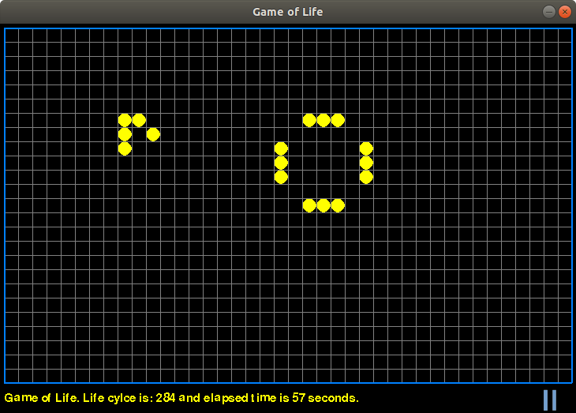

# Game-of-Life-no-not-again-
>An implementation of Conway Game of Life pure to learn Python classes, definitions, pygame
>core was borrowed from redevined/conway



*a finger exercise to learn Python*

Author: Bruno Vermeulen<br /> 
Email: bruno_vermeulen2001yahoo.com<br />

##Use:

for python 2.7 use:
```sh 
 python GOL_exercise [configfile [patternfile]]
``` 
for python 3.6
```sh
python3 GOL_exercise_p36 [configfile [patternfile]]
```
* note if no first argument is given the program uses the default config file data/config.txt
* if no second argument is given the program uses the patternfile as defined in the config file
   
Following input is possible:
* Space  : pause or run
* b      : set border to blue
* o      : set border to orange
* c      : clears the field
* l      : load patternfile
* s      : save patternfile ! note it will overwrite the original patternfile
* Escape : leave program

If mouse is clicked inside the action window then a new cell will either be created or deleted depending if the cell was life or not
